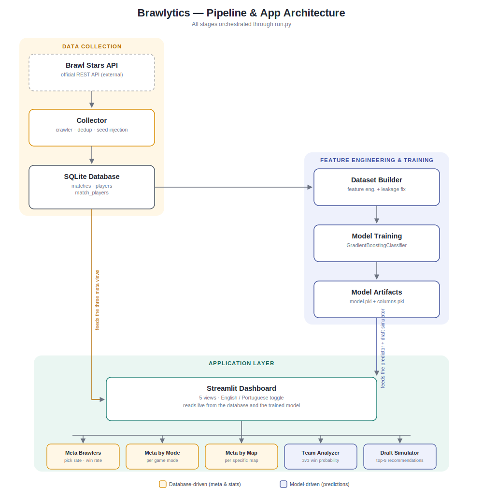

# Brawlytics

**A Brawl Stars analytics platform: real match data, a self-built ETL/ML pipeline, and a bilingual Streamlit dashboard for meta insights and win prediction.**


This project was born as a personal challenge right after finishing the AI Specialist track from Alura, as part of Santander's *Imersão Digital* program. I wanted to put the concepts into practice on something I actually care about instead of a toy dataset — so I picked Brawl Stars, a game I already know well, and set out to answer a simple question: **can you predict who wins a match?**

Turns out the honest answer is "not really, not from the data you can actually get" — and that discovery ended up shaping the whole project. More on that below.

---

## Table of Contents

- [What it does](#what-it-does)
- [Why a prediction model *and* a dashboard](#why-a-prediction-model-and-a-dashboard)
- [Architecture](#architecture)
- [The data pipeline](#the-data-pipeline)
- [Model: what, why, and its real limits](#model-what-why-and-its-real-limits)
- [The dashboard](#the-dashboard)
- [Internationalization](#internationalization)
- [Project structure](#project-structure)
- [Running it locally](#running-it-locally)
- [Lessons learned](#lessons-learned)
- [Roadmap / ideas](#roadmap--ideas)

---

## What it does

Brawlytics collects real 3v3 match data from the official [Brawl Stars API](https://developer.brawlstars.com/), stores it in a relational SQLite database, turns it into a training-ready dataset, and serves everything through a Streamlit app with five views:

- **Meta Brawlers** — global pick rate, win rate, and a composite "Meta Score" per brawler.
- **Meta by Mode** — the same stats broken down by game mode (Gem Grab, Brawl Ball, Heist, etc.).
- **Meta by Map** — the same stats broken down by specific map, since balance shifts a lot map to map.
- **Team Analyzer** — pick a mode, a map, and two full 3-brawler teams, and get a predicted win probability.
- **Draft Simulator** — pick a mode, a map, and a partial draft, and get the top 5 recommended brawlers to fill the remaining slot(s), ranked by predicted win probability.

## Why a prediction model *and* a dashboard

My original plan was simpler: build a model that predicts who wins a match. Reality got in the way pretty quickly.

The Brawl Stars API battlelog gives you *what* was picked (brawlers, map, mode) and *who won*, but it doesn't give you the two things that matter most in a real match:

1. **Player skill.** Two people with the same brawler at the same power level can have wildly different win rates depending on mechanical skill, game sense, and positioning. There's no field for that.
2. **Brawler power/gear level relative to the opponent.** The API exposes it, but it's noisy, inconsistent across the playerbase, and not something a user planning a draft can reliably "input" ahead of time anyway — you don't know your opponent's gear before the match starts.

In other words, the single biggest predictors of a win are things that are either *not in the data* or *not knowable at prediction time*. A model trained only on team composition, map, and mode was never going to be highly accurate — and I think pretending otherwise would have been dishonest.

So the project pivoted: instead of over-promising a "will I win?" oracle, I built out a proper **data visualization layer** (the meta views) as the real deliverable, and kept the predictive model as a secondary, clearly-scoped tool — a **composition-only signal**, not a crystal ball. The Team Analyzer and Draft Simulator are useful for "does this comp have a structural edge on this map," which is a fair question to ask of this data. They are not useful for "will I personally win this game," which depends on you.

## Architecture



The pipeline runs left-to-right, top-to-bottom: the crawler feeds the database, the database feeds both the ML pipeline and the dashboard's meta views directly, and the trained model feeds only the predictive views (Team Analyzer, Draft Simulator). Everything is orchestrated through a single interactive CLI (`run.py`): reset the DB, run the crawler, build the dataset, train the model, or run the engineering tests — no need to remember individual script paths.

## The data pipeline

**Collection (`data/collector/collector.py`)**
A polling crawler that reads player battlelogs from the official API. To avoid the classic "matchmaking bubble" problem (only ever seeing games from your own skill/region cluster), it periodically injects fresh seed players from the global rankings, and it deduplicates matches with a SHA-256 hash of `battle_time + sorted player tags`, so the same battle reported by multiple players never gets counted twice.

**Storage (`data/database/`)**
A simple, normalized SQLite schema: `matches` (mode, map, duration), `players` (tag, scan cooldown), and `match_players` (the join table with brawler, power, trophies, and result per player per match). Nothing fancy — it just needs to survive repeated incremental crawls without duplicating data.

**Dataset building (`data/preprocessing/dataset_builder.py`)**
This is where the raw relational data becomes a training matrix, and where the two most important engineering decisions in the project live:

- **Community map filtering.** The API returns matches from community-made maps too, which are far less standardized (weird geometry, low sample sizes, not part of the competitive rotation). The `assets/maps/` folder — the same images used by the UI — doubles as the source of truth for "official" maps, so anything not in there gets dropped.
- **Anti-bias shuffle (the leakage fix).** Because the crawler always scans a *target* player and labels their team as `team_id = 0`, and the crawler seeds itself from elite/high-ranked players, `team_id 0` ended up correlated with stronger players — a silent label leak that inflated apparent accuracy without the model actually learning anything about brawler composition. The fix: deterministically decide, per match (via a hash of the match ID), whether to swap `team_0`/`team_1` and flip the target label accordingly. This removes the "who was the crawler's seed" signal while keeping the data fully reproducible. It also means composition order doesn't matter for the label — brawler lists are sorted alphabetically per team before encoding, so the model isn't accidentally learning "brawler in slot 1" instead of "brawler is on this team" (permutation invariance).

Only complete, valid 3v3 matches with a clear win/loss (draws and unknown results are dropped) make it into the final CSV.

## Model: what, why, and its real limits

**Model choice: `GradientBoostingClassifier` (scikit-learn)**

I went with gradient boosting over alternatives like logistic regression or a plain random forest for a few reasons:

- The feature space is almost entirely **high-cardinality one-hot data** (which brawler is on which team, which map, which mode) — mostly binary, sparse, and with a lot of conditional interactions ("brawler X is strong specifically *against* brawler Y, specifically *on* this map"). Boosted trees are good at picking up that kind of non-linear, interaction-heavy signal without needing me to hand-engineer every matchup feature.
- Compared to a single decision tree or a shallow random forest, boosting tends to generalize a bit better on data where the true signal-to-noise ratio is low — which, as discussed above, is exactly this dataset's situation. It doesn't fix the fundamental information gap, but it squeezes more out of what's actually there than a simpler linear model did in early testing.
- It's fast enough to retrain from scratch on a few thousand matches on a laptop, which matters for an iterative side project with no dedicated training infrastructure.

**Feature engineering**

Each match becomes one row: the game mode and map (one-hot encoded), and each team's three brawlers represented as **multi-hot columns** (`t0_<brawler>`, `t1_<brawler>` = 1 or 0) rather than three ordered "brawler 1/2/3" slots. That encoding directly captures *which brawlers are on which team*, independent of pick order — a team of Bull + Poco + El Primo should look identical to the model no matter which slot each one was typed into.

Deliberately **excluded**: brawler power level and trophies. They're in the raw data, but as explained above, they're not reliably available *before* a match starts, and including them would make the model unusable for its actual purpose (drafting), while also encouraging it to lean on a proxy for player skill instead of learning anything about composition.

**Honest results**

Cross-validated accuracy tops out around **68–70%**, against a majority-class baseline of roughly 50–51% (the dataset is close to balanced after the anti-bias fix). That's a real, non-trivial signal — team composition clearly matters — but it's far from a reliable win predictor, and it isn't trying to be one. I'd frame it as: **useful for spotting a structural composition disadvantage before a match, not useful for guaranteeing an outcome.**

The clearest lever to improve this further is more data. At the current dataset size (a few thousand matches), rarer brawler combinations are seen too few times for their win-rate signal to stabilize; scaling into the 10k–50k match range should sharpen the per-composition estimates meaningfully, even without changing the model or features at all.

## The dashboard

Built with **Streamlit**. Five views, all reading from the same SQLite database and the same trained model:

| View | What it shows |
|---|---|
| **Meta Brawlers** | Global pick rate and win rate per brawler, plus a composite *Meta Score* (60% win rate + 40% normalized pick rate) to surface brawlers that are both strong *and* actually being played — filtering out low-sample outliers. |
| **Meta by Mode** | The same stats, segmented per game mode. |
| **Meta by Map** | The same stats, segmented per specific map — since map geometry changes brawler viability a lot more than mode alone. |
| **Team Analyzer** | Full 3v3 vs 3v3 win probability for a given mode/map, from the trained model. |
| **Draft Simulator** | Given a mode, map, and a partially-filled draft, ranks the top 5 remaining brawlers by simulated win probability (it runs the model once per candidate brawler and sorts the results). |

A quick note on the views themselves: I'm not a frontend/design person by trade, so the Streamlit layout, styling, and UI copy for these views were generated with AI assistance and then adjusted to fit the data and the app's actual behavior. The data pipeline, database design, feature engineering, and model logic are my own work; the visual polish had AI help.

## Internationalization

The whole UI ships in **English and Portuguese**, toggleable at runtime from the sidebar. All strings live in `locales/en.json` / `locales/pt.json` and are resolved through a small `t(key)` helper — nothing is hardcoded per language in the views. The two translation files were also produced with AI assistance to keep both versions consistent and natural, rather than one being a literal (and awkward) translation of the other.

## Project structure

```
brawlytics/
├── app/
│   ├── main.py                # Streamlit entrypoint, nav, language switcher
│   ├── i18n.py                 # Translation loader/helper
│   ├── utils.py                 # DB access, asset lookup, model loading (cached)
│   └── views/                  # One file per dashboard tab
├── data/
│   ├── collector/               # API crawler
│   ├── database/                 # SQLite schema + connection helper
│   ├── preprocessing/            # Dataset builder (feature eng. + leakage fix)
│   ├── training/                  # Model training script
│   ├── prediction/                 # Inference helpers used by the UI
│   └── storage/                     # dataset_brawl.csv, model.pkl, columns.pkl, brawl_data.db
├── assets/
│   ├── brawlers/                # Brawler portraits (source of truth for valid brawler list)
│   └── maps/                      # Map images (source of truth for "official" maps)
├── locales/                     # en.json / pt.json
├── tests/                        # Sanity checks (brawler frequency, clustering)
└── run.py                         # Interactive CLI to run the whole pipeline
```

## Running it locally

```bash
git clone <this-repo>
cd brawlytics
pip install -r requirements.txt

# create a .env file with your own API key:
echo "BRAWL_API_TOKEN=your_token_here" > .env
```

Get a token from the [Brawl Stars developer portal](https://developer.brawlstars.com/).

```bash
python run.py
```

From the interactive menu you can:

1. Initialize the database
2. Run the collector (crawls fresh matches — takes a while, respects the API rate limit)
3. Build the dataset (feature engineering + leakage fix)
4. Train the model
5. Run the engineering tests

Once you have a database and a trained model in `data/storage/`, launch the dashboard:

```bash
streamlit run app/main.py
```

## Lessons learned

- **The most valuable outcome of this project wasn't the model — it was learning to recognize when a model *shouldn't* be trusted too far**, and building the visualization layer to be genuinely useful on its own instead of just a wrapper around a shaky prediction.
- Label leakage can be extremely subtle. `team_id 0` correlating with "the crawler's seed player" wasn't an obvious bug — it only showed up as a suspiciously inflated accuracy number, which was the actual clue something was wrong.
- Treating the `assets/` folders (brawler portraits, map images) as the single source of truth for "what counts as valid" turned out to be a clean way to keep the UI, the data filtering, and the model's feature space all in sync without maintaining three separate lists.

## Roadmap / ideas

- Scale data collection to 10k–50k+ matches to stabilize win-rate estimates for less common compositions.
- Explore pairwise/synergy and counter-pick features explicitly (currently the model has to infer these interactions on its own from one-hot columns).
- Add a lightweight model card / confidence indicator directly in the Team Analyzer and Draft Simulator UI, so the accuracy caveat is visible in-app, not just in this README.

---

*Built as a self-directed project after completing Alura's AI Specialist track (Santander Imersão Digital). Not affiliated with Supercell.*
